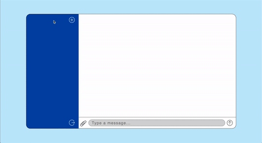
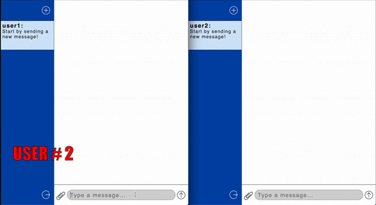
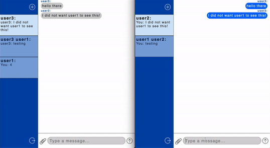

# SimpleChat 💭 - App
[Client](https://github.com/DannyBrito/Eclone-client)
> A real-time chat app that allows quick user communication.

## Features:
An user is able to:
<ul> 
    <li />create new indivual chats
    <li />create new group chats
    <li /> add any user into a chat
    <li /> login/sign up/ log out
    <li /> save chats into indivial accounts
</ul>

##### Login & Signup (Screens)
A user can log in or sign up for the app. SimpleChat is integrated with Auth0.

##### New Individual/Group Chat Modal
When a user creates a new chat, it is presented by a new chat modal. The modal allows to create individual/group chats.

##### Real-Time Chat Updates
All users have the ability to send and receive real-time messages.

##### App's Responsiveness
SimpleChat was developed with responsiveness in mind. Depending on the window's size, the application will adapt its layout accordingly.

##### Media Files & Emoji Support 👍
SimpleChat has support for Emojis and & image files.

## Technologies

<ul>
<li />Bcrypt
<li />Cors
<li />Dotenv
<li />Express
<li />Jest
<li />Jsonwebtoken
<li />Mongoose
<li />Morgan
<li />Nodemon
<li />Node.js
<li />Socket.io
<li />Supertest
<li />React.js
<li />React-dom
<li />React Router
<li />React Uuid
<li />React Scroll to Bottom
<li />Socket.io Client
</ul>

## Meta

Danny Brito – [LinkedIn](https://www.linkedin.com/in/dannybrito) - [Github](https://github.com/DannyBrito)

